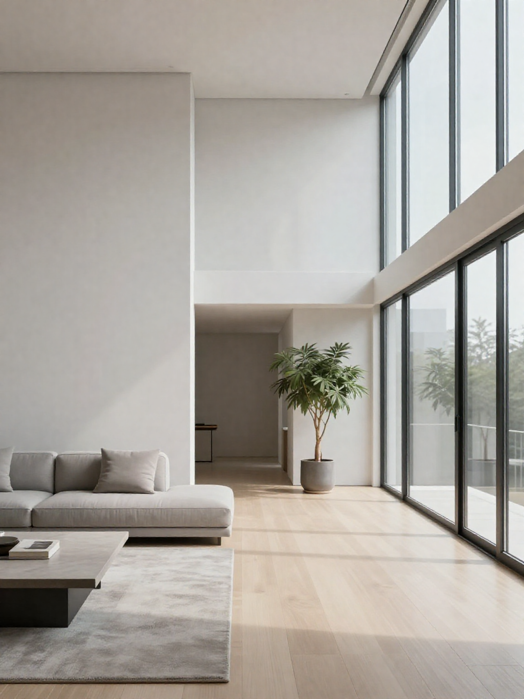
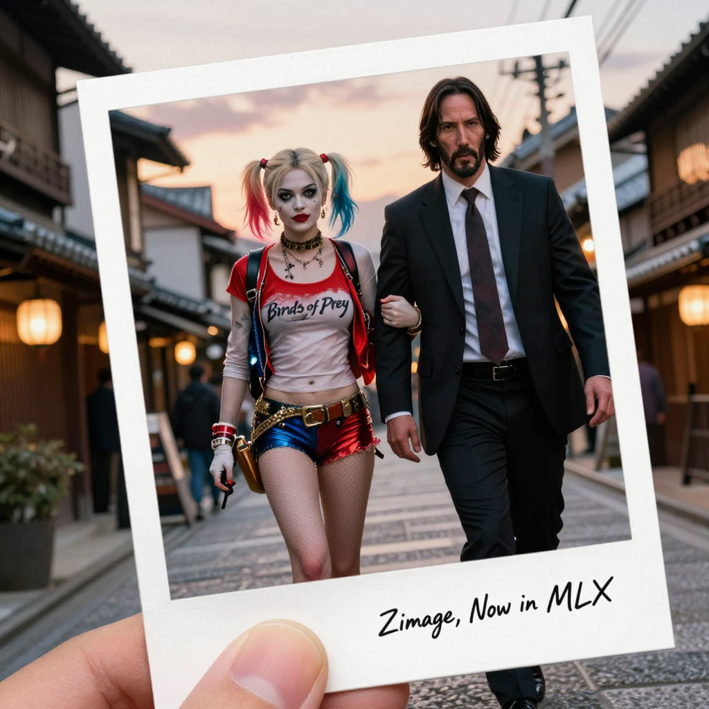

# Z-Image.swift

Swift port of [Z-Image-Turbo](https://huggingface.co/Tongyi-MAI/Z-Image-Turbo) using [mlx-swift](https://github.com/ml-explore/mlx-swift) for Apple Silicon.

**Try it with an easy UI:** [Lingdong Desktop App](https://lingdong.app/en)

## Requirements

- macOS 14.0+
- Apple Silicon
- Swift 5.9+

## Installation

### Building from Source

```bash
xcodebuild -scheme ZImageCLI -configuration Release -destination 'platform=macOS' -derivedDataPath .build/xcode
```

The CLI binary will be available at `.build/xcode/Build/Products/Release/ZImageCLI`.

## Usage

```bash
ZImageCLI -p "A beautiful mountain landscape at sunset" -o output.png
```

For all available options:

```bash
ZImageCLI -h
```

### Options

| Option | Description | Default |
|--------|-------------|---------|
| `-p, --prompt` | Text prompt (required) | - |
| `--negative-prompt` | Negative prompt | - |
| `-W, --width` | Output width | 1024 |
| `-H, --height` | Output height | 1024 |
| `-s, --steps` | Inference steps | 9 |
| `-g, --guidance` | Guidance scale | 3.0 |
| `--seed` | Random seed | random |
| `-o, --output` | Output path | z-image.png |
| `-m, --model` | Model path (dir or .safetensors) or HuggingFace ID | Tongyi-MAI/Z-Image-Turbo |
| `--force-transformer-override-only` | Treat local .safetensors as transformer-only (disable AIO detection) | false |
| `--cache-limit` | GPU memory cache limit in MB | unlimited |
| `-l, --lora` | LoRA weights path or HuggingFace ID | - |
| `--lora-scale` | LoRA scale factor | 1.0 |
| `-e, --enhance` | Enhance prompt using LLM | false |
| `--enhance-max-tokens` | Max tokens for prompt enhancement | 512 |
| `--no-progress` | Disable progress output | false |

## AIO Checkpoint Usage

You can load a single `.safetensors` file containing the Transformer, Text Encoder, and VAE (AIO) directly:

```bash
ZImageCLI -p "a cozy cabin" -m path/to/z_image_turbo_aio.safetensors
```

If the file is detected as an AIO checkpoint, it will skip loading base model weights and use the components from the file. To force it to be treated as a transformer-only override (overlaying base weights), use `--force-transformer-override-only`.

## Examples

```bash
# Basic generation
ZImageCLI -p "a cute cat sitting on a windowsill" -o cat.png

# Portrait image with custom size
ZImageCLI -p "portrait of a woman in renaissance style" -W 768 -H 1152 -o portrait.png

# Using quantized model for lower memory usage
ZImageCLI -p "a futuristic city at night" -m mzbac/Z-Image-Turbo-8bit -o city.png

# With memory limit
ZImageCLI -p "abstract art" --cache-limit 2048 -o art.png

# With LoRA
ZImageCLI -p "a lion" --lora ostris/z_image_turbo_childrens_drawings -o lion.png
```

## LoRA

Apply LoRA weights for style customization:

```bash
ZImageCLI -p "a lion" --lora ostris/z_image_turbo_childrens_drawings --lora-scale 1.0 -o lion.png
```

### LoRA Example

<table width="100%">
<tr>
<th>Prompt</th>
<th>LoRA</th>
<th>Output</th>
</tr>
<tr>
<td>a lion</td>
<td><a href="https://huggingface.co/ostris/z_image_turbo_childrens_drawings">ostris/z_image_turbo_childrens_drawings</a></td>
<td></td>
</tr>
</table>

## ControlNet

Generate images with ControlNet conditioning using Canny, HED, Depth, Pose, or MLSD control images:

```bash
ZImageCLI control \
  --prompt "A hyper-realistic close-up portrait of a leopard" \
  --control-image canny_edges.jpg \
  --controlnet-weights alibaba-pai/Z-Image-Turbo-Fun-Controlnet-Union-2.0 \
  --control-file Z-Image-Turbo-Fun-Controlnet-Union-2.1.safetensors \
  --control-scale 0.75 \
  --output leopard.png
```

### ControlNet Options

| Option | Description | Default |
|--------|-------------|---------|
| `-p, --prompt` | Text prompt (required) | - |
| `-c, --control-image` | Control image path (Canny/HED/Pose/Depth/MLSD) | - |
| `-i, --inpaint-image` | Source image for inpainting | - |
| `--mask, --mask-image` | Mask image for inpainting | - |
| `--cw, --controlnet-weights` | ControlNet weights path or HuggingFace ID (required) | - |
| `--cf, --control-file` | Specific .safetensors file within weights directory | - |
| `--cs, --control-scale` | Control context scale | 0.75 |
| `-W, --width` | Output width | 1024 |
| `-H, --height` | Output height | 1024 |
| `-s, --steps` | Inference steps | 9 |
| `-g, --guidance` | Guidance scale | 3.0 |
| `--seed` | Random seed | random |
| `-o, --output` | Output path | z-image-control.png |
| `-m, --model` | Model path or HuggingFace ID | Tongyi-MAI/Z-Image-Turbo |
| `--cache-limit` | GPU memory cache limit in MB | unlimited |

### ControlNet Examples

| Control Type | Prompt | Control Image | Output |
|--------------|--------|---------------|--------|
| Canny | A hyper-realistic close-up portrait of a leopard face hiding behind dense green jungle leaves, camouflaged, direct eye contact, intricate fur detail, bright yellow eyes, cinematic lighting, soft shadows, National Geographic photography, 8k, sharp focus, depth of field |  |  |
| HED | A photorealistic film still of a man in a dark shirt sitting at a dining table in a modern kitchen at night, looking down at a bowl of soup. A glass bottle and a glass of white wine are in the foreground. Warm, low, cinematic lighting, soft shadows, shallow depth of field, contemplative atmosphere, highly detailed. |  |  |
| Depth | A hyperrealistic architectural photograph of a spacious, minimalist modern hallway interior. Large floor-to-ceiling windows on the right wall fill the space with bright natural daylight. A light gray sectional sofa and a low, modern coffee table are placed in the foreground on a light wood floor. A large potted plant is visible further down the hallway. White walls, clean lines, serene atmosphere, highly detailed, 8k resolution, cinematic lighting |  |  |
| Pose | 一位年轻女子站在阳光明媚的海岸线上，白裙在轻拂的海风中微微飘动。她拥有一头鲜艳的紫色长发，在风中轻盈舞动... |  |  |

## Example Text To Image Output

| Prompt | Output |
|--------|--------|
| A dramatic, cinematic japanese-action scene in a edo era Kyoto city. A woman named Harley Quinn from the movie "Birds of Prey" in colorful, punk-inspired comic-villain attire walks confidently while holding the arm of a serious-looking man named John Wick played by Keanu Reeves from the fantastic film John Wick 2 in a black suit, her t-shirt says "Birds of Prey", the characters are capture in a postcard held by a hand in front of a beautiful realistic city at sunset and there is cursive writing that says "ZImage, Now in MLX" |  |

## Quantization

Quantize the model to reduce memory usage:

```bash
ZImageCLI quantize -i models/z-image-turbo -o models/z-image-turbo-q8 --bits 8 --group-size 32 --verbose
```

### Performance

| Model | Memory | Time (1024x1024) |
|-------|--------|------------------|
| BF16 | ~21 GB | ~46s |
| 8-bit quantized | ~7.5 GB | ~44s |

*Tested on Apple M2 Ultra*

## Dependencies

- [mlx-swift](https://github.com/ml-explore/mlx-swift) - Apple's ML framework for Apple Silicon
- [swift-transformers](https://github.com/huggingface/swift-transformers) - Tokenizer support
- [swift-argument-parser](https://github.com/apple/swift-argument-parser) - CLI argument parsing

## License

MIT License
