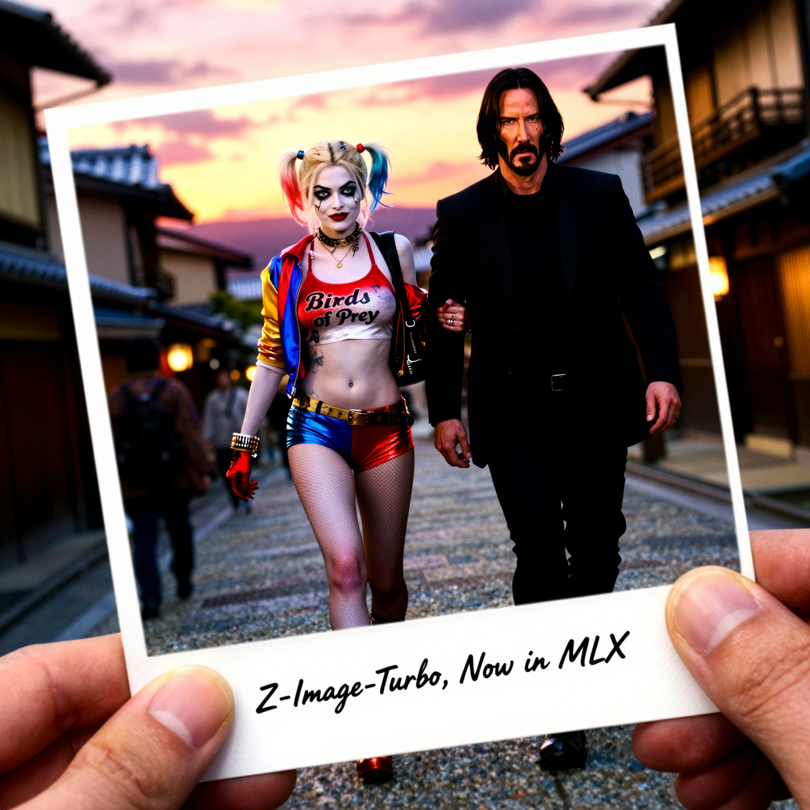
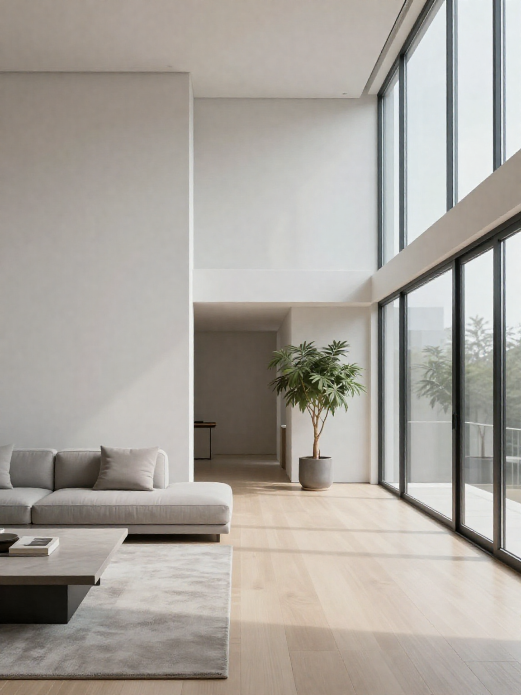

# Z-Image.swift

> An enhanced fork of the `mzbac/zimage.swift` project.

Native Swift + MLX implementation of the `Tongyi-MAI/Z-Image` model family for Apple Silicon.

The repo ships:

- `ZImage`: a Swift library for macOS and iOS targets
- `ZImageCLI`: a macOS CLI for text-to-image, ControlNet, inpainting, and quantization workflows
- `ZImageServe`: a macOS staging daemon/client for queued local generation requests

The practical goal is to run Z-Image locally without a Python runtime while still supporting the model-loading patterns people actually use: Hugging Face snapshots, local Diffusers-style folders, quantized directories, LoRA adapters, and text-to-image AIO / transformer-only `.safetensors` files.

## Current Capabilities

- Text-to-image generation with the Z-Image diffusion transformer and Flow Match scheduler
- ControlNet conditioning and inpainting via `ZImageCLI control`
- LoRA and LoKr adapters on both generation pipelines and CLI paths
- Optional prompt enhancement on both generation pipelines and CLI paths through the Qwen text encoder generation flow
- 4-bit and 8-bit quantization for base-model and ControlNet directories
- Hugging Face cache reuse, local Diffusers-style directories, and text-to-image AIO / transformer-only `.safetensors`

The default CLI model is `Tongyi-MAI/Z-Image-Turbo`.

Known `Tongyi-MAI` ids get model-aware defaults:

- Turbo: `1024x1024`, `9` steps, guidance `0.0`
- Base: `1024x1024`, `50` steps, guidance `4.0`

Known ids, inspectable local or cached snapshots, and common Z-Image-style aliases get model-aware defaults. Completely unrecognized models still fall back to Turbo-compatible defaults unless you set `--steps` and `--guidance` explicitly.

## Examples

### Text To Image Examples

> Z-Image-Turbo

| Prompt | Output |
|--------|--------|
| A dramatic, cinematic japanese-action scene in a edo era Kyoto city. A woman named Harley Quinn from the movie "Birds of Prey" in colorful, punk-inspired comic-villain attire walks confidently while holding the arm of a serious-looking man named John Wick played by Keanu Reeves from the fantastic film John Wick 2 in a black suit, her t-shirt says "Birds of Prey", the characters are capture in a postcard held by a hand in front of a beautiful realistic city at sunset and there is cursive writing that says "Z-Image-Turbo, Now in MLX" |  |


> Z-Image (Base)

| Prompt | Output |
|--------|--------|
| A dramatic, cinematic japanese-action scene in a edo era Kyoto city. A woman named Harley Quinn from the movie "Birds of Prey" in colorful, punk-inspired comic-villain attire walks confidently while holding the arm of a serious-looking man named John Wick played by Keanu Reeves from the fantastic film John Wick 2 in a black suit, her t-shirt says "Birds of Prey", the characters are capture in a postcard held by a hand in front of a beautiful realistic city at sunset and there is cursive writing that says "Z-Image, Now in MLX" |  |

Note:
- generated with `--negative-prompt "卡通,油画质感,低分辨率,塑料材质,光滑"`


### LoRA/LoKr Examples (Z-Image-Turbo)

#### LoKr adapter `F16/z-image-turbo-flow-dpo`

| Prompt | Output |
|--------|--------|
| A dramatic, cinematic japanese-action scene in a edo era Kyoto city. A woman named Harley Quinn from the movie "Birds of Prey" in colorful, punk-inspired comic-villain attire walks confidently while holding the arm of a serious-looking man named John Wick played by Keanu Reeves from the fantastic film John Wick 2 in a black suit, her t-shirt says "Birds of Prey", the characters are capture in a postcard held by a hand in front of a beautiful realistic city at sunset and there is cursive writing that says "Z-Image-Turbo, Now in MLX" |  |

Note:
- generated with `--negative-prompt "卡通,油画质感,低分辨率,毛绒材质,塑料材质,光滑"` and `--steps 9 --guidance 1.0`

### ControlNet Examples (Z-Image-Turbo)

| Control Type | Prompt | Control Image | Output |
|--------------|--------|---------------|--------|
| Canny | A hyper-realistic close-up portrait of a leopard face hiding behind dense green jungle leaves, camouflaged, direct eye contact, intricate fur detail, bright yellow eyes, cinematic lighting, soft shadows, National Geographic photography, 8k, sharp focus, depth of field |  |  |
| HED | A photorealistic film still of a man in a dark shirt sitting at a dining table in a modern kitchen at night, looking down at a bowl of soup. A glass bottle and a glass of white wine are in the foreground. Warm, low, cinematic lighting, soft shadows, shallow depth of field, contemplative atmosphere, highly detailed. |  |  |
| Depth | A hyperrealistic architectural photograph of a spacious, minimalist modern hallway interior. Large floor-to-ceiling windows on the right wall fill the space with bright natural daylight. A light gray sectional sofa and a low, modern coffee table are placed in the foreground on a light wood floor. A large potted plant is visible further down the hallway. Besides the plant, the hallway extends into the darkness, suggesting further space. White walls, clean lines, serene atmosphere, highly detailed, 8k resolution, cinematic lighting |  |  |
| Pose | 一位年轻女子站在阳光明媚的海岸线上，白裙在轻拂的海风中微微飘动。她拥有一头鲜艳的紫色长发，在风中轻盈舞动... |  |  |

Note:
- generated with `--negative-prompt "卡通,油画质感,低分辨率,塑料材质,光滑"` and `--control-scale 0.75`
- ControlNet weights: `alibaba-pai/Z-Image-Turbo-Fun-Controlnet-Union-2.1`
- Control file: `Z-Image-Turbo-Fun-Controlnet-Union-2.1-2602-8steps.safetensors`

## Quickstart

### Prerequisites

- Apple Silicon Mac
- macOS 14.0+
- Xcode 16.x or another Swift 6 toolchain that can build the package
- Network access on first run unless the weights are already cached locally

### Build

```bash
./scripts/build.sh
```

### Verify

```bash
swift test
```

### Run

```bash
cd .build/xcode/Build/Products/Release
./ZImageCLI --help
./ZImageServe --help
./ZImageCLI -p "a studio photo of a red apple on black velvet" -o output.png
```

The first run downloads the default snapshot into the Hugging Face cache.

### Minimal CLI Examples

Turbo defaults:

```bash
./ZImageCLI -p "a neon-lit alley in the rain" -o turbo.png
```

Base model:

```bash
./ZImageCLI \
  -m Tongyi-MAI/Z-Image \
  -p "a black tiger in a bamboo forest" \
  -o base.png
```

Text-to-image LoRA:

```bash
./ZImageCLI \
  -p "a lion painted like a children's book illustration" \
  --lora ostris/z_image_turbo_childrens_drawings \
  --lora-scale 1.0 \
  -o lora.png
```

ControlNet:

```bash
./ZImageCLI control \
  --prompt "a dancer on a stage" \
  --control-image /path/to/pose.jpg \
  --controlnet-weights alibaba-pai/Z-Image-Turbo-Fun-Controlnet-Union-2.1 \
  --control-file Z-Image-Turbo-Fun-Controlnet-Union-2.1-2602-8steps.safetensors \
  --output control.png
```

Staging daemon:

```bash
./ZImageServe serve --residency-policy adaptive --warm-model mzbac/z-image-turbo-8bit
./ZImageServe -p "a neon-lit alley in the rain" -o staged.png
./ZImageServe status
./ZImageServe shutdown
```

Structured staged submission:

```bash
./ZImageServe batch jobs.json
./ZImageServe markdown prompts.md
```

`ZImageServe` reuses the normal generation flags for ad hoc requests, prints the accepted job id for cancellation, exposes `status`, `cancel`, and `shutdown` for daemon operations, and keeps JSON/markdown ingestion on the client side so the socket protocol stays canonical. Markdown ingestion accepts single fenced `bash`/`sh`/`zsh` invocations for direct `ZImageCLI` or `ZImageServe` commands, including explicit relative or absolute executable paths. Command substitutions are resolved when each markdown item starts, while wrappers, shell control operators, and other shell expansion syntax remain rejected.

`ZImageCLI control` also accepts `--lora`, `--lora-scale`, `--enhance`, and `--enhance-max-tokens`.

Quantize a local base-model directory:

```bash
./ZImageCLI quantize \
  --input models/z-image-turbo \
  --output models/z-image-turbo-q8 \
  --bits 8 \
  --group-size 32
```

### Library Entry Points

The library surface is pipeline-first:

- `ZImageGenerationRequest` + `ZImagePipeline`
- `ZImageControlGenerationRequest` + `ZImageControlPipeline`

The code map for those entry points lives in [docs/ARCHITECTURE.md](docs/ARCHITECTURE.md).

## Configuration

Common CLI knobs:

- `--model/-m`: text-to-image accepts a Hugging Face repo id, local Diffusers-style directory, or local `.safetensors`; the control path expects a standard snapshot or directory
- `--width/-W`, `--height/-H`: output size; values must be at least `64` and divisible by `16`
- `--steps/-s`: literal denoising iterations / transformer forwards
  - the scheduler keeps one extra terminal sigma internally, so `8` steps means `8` transformer calls and `9` sigma values
  - some upstream model cards mix that scheduler detail into the prose around Turbo's "8-step" distillation; this repo treats `steps` as the literal iteration count
- `--guidance/-g`: CFG scale
- `--cfg-normalization`: clamp CFG output norm back to the positive-branch norm
- `--cfg-truncation`: disable CFG once the normalized denoising timestep passes the given threshold
- `--weights-variant`: prefer `fp16` or `bf16` component files when the snapshot ships multiple variants
- `--force-transformer-override-only`: text-to-image only; skip AIO auto-detection for a local `.safetensors`
- `--cache-limit`: MLX GPU cache limit in MB
- `--max-sequence-length`: prompt token limit for text encoding

Validation errors now exit non-zero and print the relevant command usage.

Environment variables:

- `HF_HUB_CACHE` or `HF_HOME`: override the Hugging Face cache root
- `HF_TOKEN`: authenticate for gated or private Hugging Face repos
- `HF_ENDPOINT`: override the Hugging Face API host

The detailed behavior for cache lookup, local-path handling, AIO checkpoints, quantization manifests, and ControlNet weight loading lives in [docs/MODELS_AND_WEIGHTS.md](docs/MODELS_AND_WEIGHTS.md).

## Current Limitations

- Model-aware defaults cover known ids, inspectable local or cached snapshots, and common Z-Image-style aliases. Completely unrecognized models still need explicit `--steps` and `--guidance` if you do not want the Turbo-compatible preset.
- Text-to-image supports local AIO / transformer-only `.safetensors`; the control path currently expects a standard model snapshot or local directory instead.
- Third-party LoRA cards can recommend different sampling settings. The CLI does not parse adapter metadata into presets.
- First-time downloads are large, and higher-resolution runs still stress unified memory.
- The CLI is macOS-only. The package declares an iOS library target, but the repo does not ship a first-party sample app.

## Docs

- [docs/README.md](docs/README.md): docs index and task-based reading order
- [docs/CLI.md](docs/CLI.md): CLI commands, flags, and examples
- [docs/MODELS_AND_WEIGHTS.md](docs/MODELS_AND_WEIGHTS.md): model ids, local paths, cache lookup, AIO checkpoints, quantization
- [docs/ARCHITECTURE.md](docs/ARCHITECTURE.md): runtime layout, entry points, and source-of-truth files
- [docs/DEVELOPMENT.md](docs/DEVELOPMENT.md): build, test, CI, packaging, and validation workflows

## Acknowledgements

- The original `mzbac/zimage.swift` repo for the initial implementation and reference point
- The `Tongyi-MAI/Z-Image` and `Tongyi-MAI/Z-Image-Turbo` teams for the models and reference outputs
- The MLX team for the Swift bindings and runtime work that made the port practical

## License

MIT License
