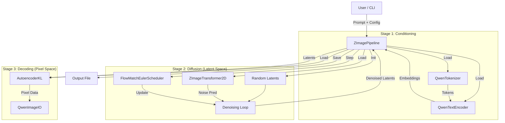

# Architecture

## 1. High-Level Architecture

The system follows a standard Latent Diffusion Model (LDM) architecture, adapted for the Z-Image-Turbo model (which uses a DiT - Diffusion Transformer).

## 2. Component Responsibilities

### Presentation Layer
- **`ZImageCLI`**: Handles argument parsing (`main.swift`), user interaction, and progress reporting. It configures the `ZImageGenerationRequest` and delegates to the Pipeline.

### Orchestration Layer
- **`ZImagePipeline`**: The primary coordinator. It handles the lifecycle of models (load/unload), manages the generation loop, and integrates LoRA/overrides.
- **`ZImageControlPipeline`**: A specialized pipeline for ControlNet, handling the additional `ControlImage` encoding and `ControlTransformer` loading.

### Model Layer (Core)
- **`QwenTextEncoder`**: A Transformer-based LLM used to encode text prompts. Uniquely, it can also "enhance" prompts by acting as a generative model before encoding.
- **`ZImageTransformer2D` (DiT)**: The backbone diffusion model. It uses a Transformer architecture (instead of a U-Net) with specialized "Refiner" blocks for noise and context processing.
- **`AutoencoderKL` (VAE)**: Compresses images into latent space (Encoder) and reconstructs them (Decoder).
- **`FlowMatchEulerScheduler`**: Implements the Flow Matching algorithm with Euler integration steps for fast sampling.

### Data & Infrastructure
- **`ZImageWeightsMapper`**: Abstracts the complexity of loading weights. It handles:
  - `.safetensors` parsing (`SafeTensorsReader`).
  - Sharded weights (multiple files).
  - Quantization (loading 4-bit/8-bit tensors).
  - Key remapping (translating external weight naming conventions).
- **`QwenImageIO`**: Handles high-performance image resizing (Lanczos) and tensor-to-image conversion using CoreGraphics.

## 3. Data Flow

### Text-to-Image Generation
1.  **Input**: Text Prompt ("A cat").
2.  **Enhancement (Optional)**: `QwenTextEncoder` generates a more detailed prompt.
3.  **Encoding**: `QwenTokenizer` -> Tokens -> `QwenTextEncoder` -> `PromptEmbeds` (Hidden States).
4.  **Latent Init**: Random Gaussian noise created (`[1, 16, H/8, W/8]`).
5.  **Denoising**:
    - For $t$ from $T$ to $0$:
        - `DiT(Latents, t, PromptEmbeds)` -> `Velocity/Noise`
        - `Scheduler.step(Latents, Velocity)` -> `NewLatents`
6.  **Decoding**: `VAE.decode(NewLatents)` -> `PixelData`.
7.  **Output**: `QwenImageIO` saves PNG.

## 4. Key Invariants & Constraints
- **Sequential Loading**: The pipeline strictly enforces loading one major model at a time (TextEncoder -> DiT -> VAE) to support 8GB/16GB RAM devices.
- **Apple Silicon Only**: The project depends on `mlx-swift` and `Metal`, making it exclusive to macOS/iOS on Apple Silicon.
- **File Formats**: Strictly relies on `.safetensors` for weights and JSON for configuration.
